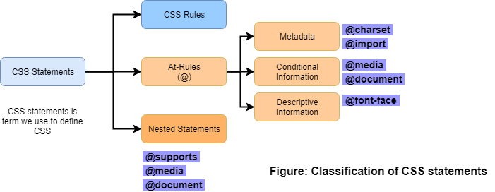
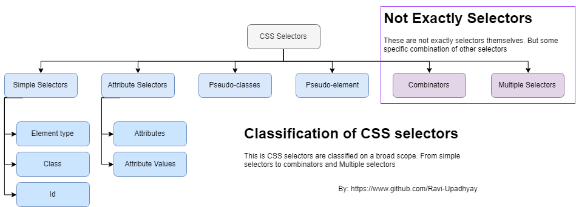
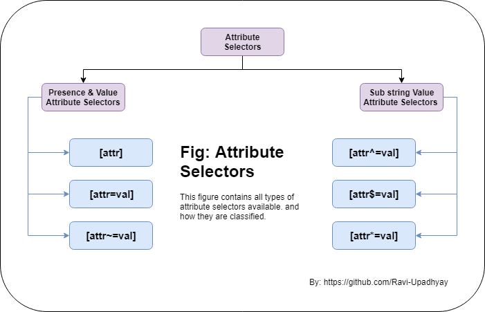
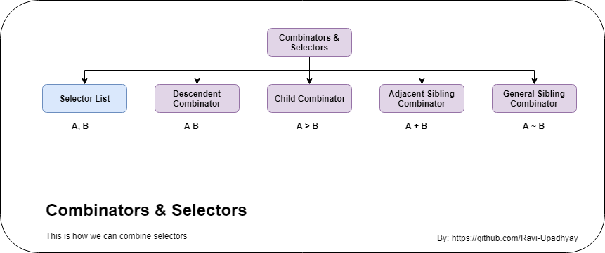

# CSS - Playground

Have come across any new implementation of CSS or just want to dive deep into the some existing concept. 
Here is my personal notebook of CSS that will consist live examples as well as notes. I will try to keep 
it minimal and simple so it can benefit others.

> Cascading Style Sheets (CSS) is a stylesheet language used to describe the presentation of a document written in HTML or XML (including XML dialects such as SVG, MathML or XHTML). CSS describes how elements should be rendered on screen, on paper, in speech, or on other media.

> **// TODO:** Under construction, This document is not completed yet. Have a look at [To-do list](#to-do) 

> Note: Important. Need to move most of the documentation and notes to the wiki. New notes are being added there: [CSS Playground Wiki](https://github.com/Ravi-Upadhyay/css-playground/wiki)

___

## Index

- [How CSS works](#how-css-work)
  - Classification of CSS statements
  - Anatomy of CSS rule
  - Rendering
  - Ways to write CSS rules
- [CSS rules - deep dive](#css-rules-deep)
  - CSS Selectors
- [Pseudo-classes and elements](sub-section/pseudo-classes-elements)
- [CSS functions](sub-section/css-functions)
- [Code snippets](#code-snippets)
- [Best practices](#best-practices)
- [Resources Over Web](#resources)
- [To do list](#to-do)

___

## How CSS works

CSS is a language for specifying how documents are presented to users — how they are styled, laid out, etc.

- A **document** is usually a text file structured using a markup language
- **Presenting** a document to a user means converting it into a usable form for your audience.
- **Web browsers** apply **CSS rules** to a document to affect how they are displayed.

### Classification of CSS statements

- **CSS Rules** are the main building blocks of a style sheet — the most common block you'll see in CSS.
- **At-rules** are used in CSS to convey metadata, conditional information, or other descriptive information. They start with an at sign (@), followed by an identifier to say what kind of rule it is

### Anatomy of CSS rules

- **Selector:**, which selects the element(s) you want to apply the updated property values to. 
- **Property:** Human-readable identifiers that indicate which stylistic features you want to change. 
- **Value:**  Each specified property is given a value, which indicates how you want to change those stylistic features.
- **Declaration:** A property paired with a value.
- **CSS declarations** are put within **CSS Declaration Blocks**.
- **CSS declaration blocks** are paired with **selectors** to produce **CSS Rulesets** (or CSS Rules).

### Rendering

1. The browser converts **HTML** and **CSS** into the **DOM (Document Object Model)**. The DOM represents the document in the computer's memory. It combines the document's content with its style.
2. The browser displays the contents of the **DOM**.
3. The **CSS engine** calculates which declarations apply to every single element of a page in order to appropriately lay it out and style it.
4. If a **property** is unknown or if a **value** is not valid for a given **property**, the declaration is deemed invalid and is wholly ignored by the browser's **CSS engine**.

### Ways to write CSS rules

| # | way used to apply css | Pros        | Cons        |
|---|-----------------------|-------------|-------------|
| 1 | External Stylesheet   | Can be used for multiple documents. Easy to maintain, Best approach | _
| 2 | Inernal Stylesheet    | Better than Inline, Relatively easy to maintain | Scope is limited to particular document, Should be avoided.
| 3 | Inline Stylesheet     | Last resort, Must be avoided | Scope is limited to particular element, redundancy is highest, Really difficult to Maintain

___

## CSS - deep dive

- ### Selectors

1.  **Simple selectors:** Match one or more elements based on `element type`, `class`, or `id`.
2.  **Attribute selectors:** Match one or more elements based on their `attributes/attribute values`.
3.  **Pseudo-classes:** Match one or more elements that exist in a certain state, such as an element that is being hovered over by the mouse pointer, or a checkbox that is currently `disabled` or `checked`, or an element that is the first child of its parent in the DOM tree.
4.  **Pseudo-elements:** Match one or more parts of content that are in a certain position in relation to an element, for example the first word of each paragraph, or generated content appearing just before an element.
5.  **Combinators:** These are not exactly selectors themselves, but ways of combining two or more selectors in useful ways for very specific selections. So for example, you could select only paragraphs that are direct descendants of divs, or paragraphs that come directly after headings. We can also refer selectors are **chained**.
6.  **Multiple selectors:** Again, these are not separate selectors; the idea is that you can put multiple selectors on the same CSS rule, separated by commas, to apply a single set of declarations to all the elements selected by those selectors.
7.  **Universal Selector (*)** It allows selecting all elements on a page. As it is rarely used to apply a style to every element on a page, it is often used in combination with other selectors
8.  An element may be matched by several selectors, therefore several rules may set a given property multiple times.
9.  CSS defines which one has **precedence** over the others and must be applied: this is called the `cascade algorithm`.

#### Classification of selectors

#### Attribute selectors

- Attribute selectors can be divided into two categories depending on the way they match attribute values: ***Presence and value attribute selectors*** and ***Substring value attribute selectors***.
- **Presence and value attribute selectors** try to match an exact attribute and value.
  - `[attr]`: Selects all elements with the attribute **attr**, whatever its value.
  - `[attr=val]`: Selects all elements with attribute **attr** and value **val**.
  - `[attr~=val]`: Selects all elements with attribute **attr** and **val** is one of space separated list of words contained in attr's value.
  
- **Substring value attribute selectors** are also known as "**RegExp-like selectors**", because they offer flexible matching in a similar fashion to regular expression (but to be clear, these selectors are not true regular expression)
  - `[attr^=val]`: Selects all elements with attribute **attr** for which value starts with **val**.
  - `[attr$=val]`: Selects all elements with attribute **attr** and for which value ends with **val**.
  - `[attr*=val]`: Selects all elements with the attribute **attr** for which the value contains the substring **val**.

#### Pseudo-classes and pseudo-elements

- They don't select element rather certain part of elements, or elements in certain contexts.
- They are classified into **pseudo-classes** and **pseudo-elements**.
- A CSS **pseudo-class** is a keyword added to the end of a selector, preceded by a **colon (:)**, which is used to specify that you want to style the selected element but only when it is in a **certain state**. Example -  `a:hover`, `input:disabled`, `input:required`
- **Pseudo-elements** are very much like pseudo-classes, but they have differences. They are keywords, this time preceded by **two colons (::)**, that can be added to the end of selectors to select a **certain part** of an element. Example - `span::after`, `span::before`

#### Combinators and selectors

- **Descendent Combinator**: Any element matching B that is a descendant of an element matching A (that is, a child, or a child of a child, etc.). the combinator is one or more spaces or dual greater than signs.
- **Child Combinator**: Any element matching B is a direct child of element matching A.
- **Adjacent Sibling Combinator**: Any element matching B that is the next sibling of an element matching A (that is, the next child of the same parent).
- **General Sibling Combinator**: Any element matching B that is one of the next siblings of an element matching A (that is, one of the next children of the same parent).

- ### Cascade and inheritance

  - In the situation where multiple CSS rules will have selectors matching the same element. In such cases, which CSS rule "*wins*", and ends up being the one that is finally applied to the element? this is controlled by mechanism called **cascade**.
  - 

---

## Code Snippets

1. [Stackblitz - code snippet - CSS selectors invalid selector in group or chain](https://stackblitz.com/edit/css-selector-experiment)

---

## Best Practices

1. You can add white space to make your style sheets more readable.
2. Add comments

---

## Resources Over Web

1. [CSS Attribute Selectors - MDN](https://developer.mozilla.org/en-US/docs/Learn/CSS/Introduction_to_CSS/Attribute_selectors)
2. [CSS Pseudo-Classes & Pseudo-Elements - MDN](https://developer.mozilla.org/en-US/docs/Learn/CSS/Introduction_to_CSS/Pseudo-classes_and_pseudo-elements)
3. [CSS Reference - MDN](https://developer.mozilla.org/en-US/docs/Web/CSS/Reference)

---

## To do list

Here I am listing down all the topics which I have to explore more. Either came across while learning CSS but decided to explore later or want to spend some more time.

1. CSS Functions (New folder created under sub-section)
   1. attr()
2. CSS properties
   1. content 
3. Experiment with attribute selectors
4. Pseudo-classes and psedo elements in detail
5. Add into Best practices section
